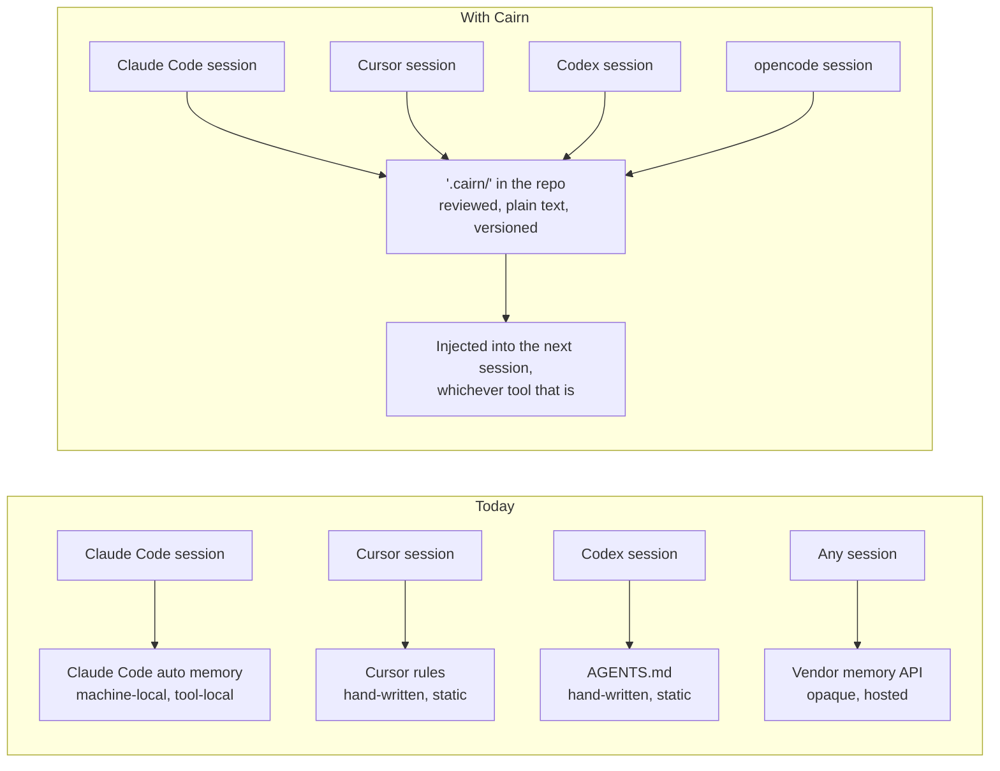
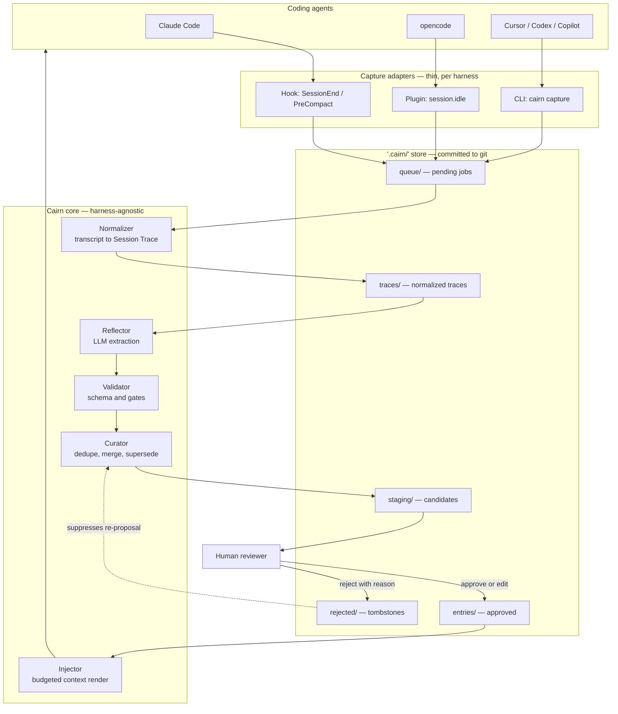
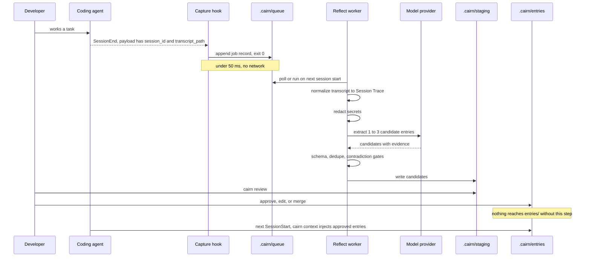
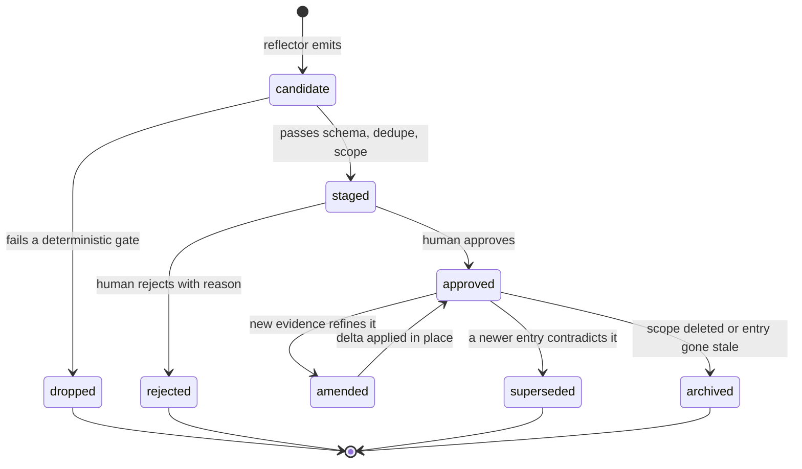
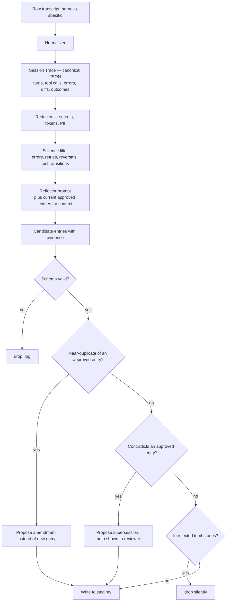
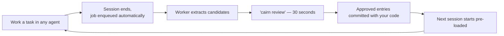
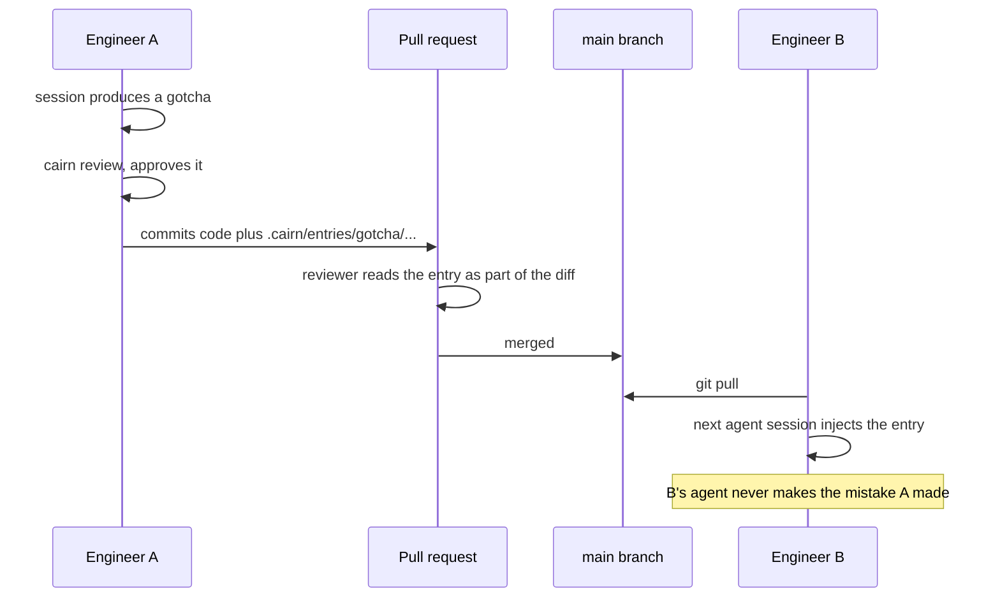

# Cairn

**Leave a marker so the next agent doesn't start from zero.**

Cairn is a harness-agnostic, git-native memory layer for AI coding agents. It turns what an agent learns during a session — the failed approach, the build-system footgun, the API quirk that cost you forty minutes — into reviewed, portable, plain-text knowledge that any agent can read in any future session.

> **Status:** pre-1.0. The `.cairn/` store specification and the capture → reflect → curate pipeline are the primary deliverables. See [Roadmap](#roadmap) for what is built and what is not.

---

## Table of contents

- [What is Cairn](#what-is-cairn)
- [Why Cairn exists](#why-cairn-exists)
- [What is new in Cairn](#what-is-new-in-cairn)
- [Features](#features)
- [Architecture](#architecture)
- [The `.cairn/` store](#the-cairn-store)
- [Workflows](#workflows)
- [Tech Stack](#tech-stack)
- [Getting Started](#getting-started)
- [Usage Examples](#usage-examples)
- [Harness adapters](#harness-adapters)
- [Evaluation](#evaluation)
- [Security and privacy](#security-and-privacy)
- [Performance budgets](#performance-budgets)
- [Roadmap](#roadmap)
- [Adoption plan](#adoption-plan)
- [Risks and open questions](#risks-and-open-questions)
- [Project structure](#project-structure)
- [Contributing](#contributing)
- [License](#license)

---

## What is Cairn

Cairn sits beside your repository as a directory of plain Markdown files. Three things happen around it:

1. **Capture.** A thin, fast adapter in your coding agent records *where* the session transcript lives and enqueues a job. It does no thinking and makes no network calls.
2. **Reflect and curate.** A separate worker reads the transcript, extracts a small number of high-signal entries, checks them against what is already stored, and writes them to a **staging** area.
3. **Review and inject.** You approve, edit, or reject each candidate. Approved entries are compiled into a small, token-budgeted context block that is injected at the start of the next session — in *any* supported tool.

The store is a **living, structured artifact** — closer to a self-maintaining engineering playbook than a transcript dump. It is committed to git, diffable, reviewable in a pull request, and readable with `cat`.

**Cairn is not:** a vector database, a hosted service, an agent framework, or a replacement for `AGENTS.md` / `CLAUDE.md`. It is a layer that produces knowledge those files can point at.

---

## Why Cairn exists

### 1. Session knowledge evaporates

Every coding session generates durable knowledge — which approach worked, which one failed and why, what the build system does when you look away. That knowledge lives in one context window and dies with it. The next session re-derives the same lesson at the same cost.

### 2. Compaction is the wrong tool for the job

Compaction is **reactive** (it fires when a token budget is hit) and **generic** (it compresses everything roughly equally). A summarizer does not know that a three-line stack trace is the whole point and five paragraphs of exploration are noise. It reduces token count without improving signal density.

This matters because long context is not free. The "lost in the middle" work (Liu et al., TACL 2024) showed a U-shaped accuracy curve where information buried mid-context is retrieved far less reliably than information at the edges. Chroma's 2025 "Context Rot" study extended this across 18 production models and found degradation as input length grows even well short of the advertised window — and, importantly, that a single distractor can push performance below baseline. Irrelevant context is not passive.

### 3. Memory that does exist is locked to one tool and one machine

Claude Code has shipped auto memory (on by default since v2.1.59, Feb 2026): Claude writes its own notes into `~/.claude/projects/<project>/memory/`, with the first 200 lines (or 25 KB) of `MEMORY.md` loaded into every session. It is genuinely useful — and it is machine-local, repo-scoped, unreviewed, and invisible to Codex, Cursor, Copilot, Gemini CLI, or anything else touching the same repository.

The hosted memory products (Mem0, ByteRover, Supermemory, Hindsight, OpenMemory and friends) solve portability by putting your knowledge in *their* store, behind an API key, retrieved by semantic search you cannot inspect. That is a reasonable trade for some teams. It is a different product from a file your team reviews in a PR.

### 4. The gap Cairn targets

No neutral layer today does all four of these at once:

- curates knowledge **from what actually happened**, not from a hand-written instruction file,
- **separates distilled knowledge from raw transcript**, with evidence linking one to the other,
- stores it in a format **any harness can read and write without running a service**,
- puts a **human approval gate** between extraction and trust.



---

## What is new in Cairn

Cairn's intellectual debt is explicit. The generate → reflect → curate loop is adapted from **ACE (Agentic Context Engineering)**, Zhang et al., Stanford / SambaNova / UC Berkeley, [arXiv:2510.04618](https://arxiv.org/abs/2510.04618), ICLR 2026. ACE treats context as an evolving playbook maintained by three roles — Generator, Reflector, Curator — and applies small **delta updates** rather than wholesale rewrites, specifically to avoid *brevity bias* (summaries that drop the domain detail) and *context collapse* (iterative rewriting eroding what was learned). Cairn borrows the loop shape and the delta-update discipline; it is not a reproduction of the paper, and it makes no claim on the paper's benchmark results.

What Cairn adds on top of the prior art:

| | Claude Code auto memory | `AGENTS.md` / `CLAUDE.md` | Hosted memory (Mem0, ByteRover, …) | ACE (research) | **Cairn** |
|---|---|---|---|---|---|
| Knowledge source | Session, automatic | Human, hand-written | Session, automatic | Execution feedback | Session, automatic |
| Where it lives | `~/.claude/...`, machine-local | Repo, committed | Vendor store / local DB | Framework-internal playbook | **Repo, committed** |
| Cross-tool | No | Yes, but static instructions only | Via SDK/MCP per tool | N/A | **Yes, by file format** |
| Human review gate | No | N/A — it is all human | No | No | **Yes, required** |
| Evidence trail per item | No | No | Varies | Counters only | **Yes — session, files, commit** |
| Inspectable in a PR diff | No | Yes | No | No | **Yes** |
| Runtime dependency to read | Claude Code | None | Service / API key | Framework | **None** |

The four bets, stated plainly:

1. **The store is a code artifact.** It lives in `.cairn/`, is committed, and changes to it arrive as diffs a human reads. Team sharing is `git pull`, not a sync service.
2. **Nothing is trusted until a human says so.** Extraction writes to `.cairn/staging/`. Only an explicit approval moves an entry into the trusted store. A curated store that *looks* authoritative but silently dropped or invented something is worse than no store at all.
3. **Every entry carries its evidence.** Session ID, harness, touched files, commit SHA, and a hash of the transcript excerpt it came from. An entry you cannot trace is an entry you cannot audit or prune.
4. **Plain text, no runtime.** Markdown with YAML frontmatter against a published JSON Schema. Reading the store requires no Cairn install, no server, no API key. Adapters are thin because the format does the work.

---

## Features

- **Harness-agnostic store** — `.cairn/` at repo root; Markdown + YAML frontmatter, schema-validated, spec-versioned.
- **Fast capture adapters** — the in-session hook only enqueues a job. No LLM calls, no network, no measurable latency at session exit.
- **Asynchronous reflect worker** — extraction runs out of band, so it is never bounded by a harness's hook budget.
- **Three entry types** — `strategy` (an approach that works for a class of problem), `gotcha` (a trap or non-obvious failure mode), `fact` (a stable, project-specific truth).
- **Deterministic curation gates** — schema validation, near-duplicate detection, contradiction detection, and scope checks run before any LLM is asked to merge anything.
- **Human review gate** — `cairn review` walks candidates one at a time: approve, edit, merge into an existing entry, or reject with a reason.
- **Delta updates, not rewrites** — approved entries are amended or superseded in place; the store does not grow monotonically and is never wholesale-regenerated.
- **Budgeted context injection** — `cairn context` renders approved entries into a token-capped block, optionally filtered by the paths you are working in.
- **Evidence and provenance** — every entry records where it came from and what it was derived from.
- **Secret redaction before extraction** — transcripts pass through a redactor before any model sees them.
- **Offline and mock modes** — `--mock` runs the full pipeline with a deterministic extractor for CI; a local model provider is supported for air-gapped use.
- **Evaluation harness** — `cairn eval` scores extraction against fixture transcripts with gold-standard entries, so "is the reflect step any good?" is a measured question, not a vibe.

---

## Architecture

### System view



### Why capture and reflect are separate processes

This is the load-bearing architectural decision, and it is forced by the runtime, not chosen for elegance.

Claude Code's `SessionEnd` hooks share a **1.5-second budget** by default (raised to match a longer per-hook `timeout`, up to 60 seconds). In practice, teardown hooks that attempt synchronous LLM calls have been reported getting killed before completion regardless of the configured timeout. A reflect step that calls a model takes seconds to tens of seconds. It cannot live inside the hook.

So the hook does one thing: append a job record and exit 0.



The worker runs in one of three ways, in order of preference: a detached background process spawned by the hook; a `SessionStart` sweep that drains the queue from the previous session; or an explicit `cairn reflect` you run yourself. All three converge on the same queue, which is why the design does not depend on any one harness's background-execution semantics.

### Entry lifecycle



`rejected/` keeps a tombstone — the entry hash and the reason — so the same low-value candidate is not re-proposed every session. This is the difference between a review gate and a review treadmill.

### Reflect pipeline in detail



The salience filter matters more than the prompt. Sessions are mostly uneventful; the lesson density is concentrated around **errors, retries, reversals, and test-status transitions**. Feeding the model the whole transcript and hoping is the expensive way to get mediocre candidates.

---

## The `.cairn/` store

### Layout

```text
.cairn/
├── VERSION                  # spec version, e.g. "0.1.0"
├── config.toml              # provider, budgets, scopes, redaction rules
├── CONTEXT.md               # generated: the injectable context block
├── entries/                 # trusted, human-approved knowledge
│   ├── strategy/
│   │   └── 2026-09-12-stream-large-fixtures-a3f9.md
│   ├── gotcha/
│   │   └── 2026-09-12-migration-order-7b21.md
│   └── fact/
│       └── 2026-09-10-staging-token-ttl-1c04.md
├── staging/                 # candidates awaiting review
├── rejected/                # tombstones: hash + reason, prevents re-proposal
├── queue/                   # pending capture jobs        (gitignored)
├── traces/                  # normalized session traces   (gitignored, TTL)
└── schema/
    ├── entry.schema.json
    └── trace.schema.json
```

Committed: `VERSION`, `config.toml`, `CONTEXT.md`, `entries/`, `staging/`, `rejected/`, `schema/`.
Gitignored: `queue/`, `traces/`.

### Entry format

Markdown with YAML frontmatter. The format choice was deliberate: JSON is easier to merge programmatically, but the reviewer is a human reading a `git diff`, and the entry body is prose. Programmatic merging is handled by the schema plus content hashing, which recovers most of what JSON would have given.

```markdown
---
id: gotcha-7b21c4
type: gotcha
title: Alembic migrations must run before the test fixtures import
status: approved
spec_version: 0.1.0
scope:
  - "tests/**"
  - "alembic/**"
tags: [testing, database, ci]
confidence: high
evidence:
  harness: claude-code
  session_id: 0f3c1a9e-6b2d-4f77-9a10-2d4c8e51b3aa
  captured_at: 2026-09-12T11:04:02Z
  artifacts:
    - tests/conftest.py
    - alembic/env.py
  commit: 9d3f1ab
  excerpt_sha256: 4f1a...c9e2
created: 2026-09-12T11:06:44Z
updated: 2026-09-12T11:06:44Z
supersedes: []
review:
  approved_by: madhav
  approved_at: 2026-09-12T18:20:10Z
usage:
  injected: 12
  marked_useful: 3
  marked_stale: 0
---

## What happens

`pytest` collects `tests/conftest.py` before the Alembic upgrade runs, so the
fixture import sees the pre-migration schema and fails with a bare
`UndefinedColumn` that names no table.

## What to do

Run `alembic upgrade head` in the session fixture, not in the CI step. The
ordering is enforced in `tests/conftest.py::_migrate`.

## Why the obvious fix does not work

Moving the upgrade into the CI workflow fixes CI and leaves local runs broken,
which is how this was mis-diagnosed twice.
```

### Entry quality criteria

These are the acceptance bar for the reflector, and the grading rubric for `cairn eval`. An entry must be:

| Criterion | Test |
|---|---|
| **Actionable** | A reader can do something differently because of it. |
| **Project-specific** | It would not be true of a random repository in the same language. |
| **Stable** | It will still be true next month, not a fact about one branch. |
| **Evidence-backed** | It points at a real artifact — file, error, commit — not a vibe. |
| **Atomic** | One claim per entry. Compound entries cannot be superseded cleanly. |
| **Non-redundant** | It is not already stated by an approved entry or by `AGENTS.md`. |
| **Future-useful** | A different agent, on a different day, would benefit from reading it. |

Anything that fails one of these is a candidate for `rejected/`, and the failed criterion is the rejection reason.

### Configuration

```toml
# .cairn/config.toml
spec_version = "0.1.0"

[provider]
name  = "anthropic"          # anthropic | openai | ollama | mock
model = "claude-sonnet-4-6"
max_output_tokens = 2000

[reflect]
max_candidates_per_session = 3
min_session_turns          = 4      # skip trivial sessions entirely
salience = ["errors", "retries", "reversals", "test_transitions"]

[inject]
token_budget    = 1500
scope_filter    = true               # only entries matching touched paths
include_types   = ["strategy", "gotcha", "fact"]

[redaction]
deny_globs = [".env*", "**/secrets/**", "**/*.pem", "**/*.key"]
patterns   = ["sk-[A-Za-z0-9]{20,}", "ghp_[A-Za-z0-9]{36}", "AKIA[0-9A-Z]{16}"]

[review]
require_human_approval = true        # v0 refuses to run without this
```

---

## Workflows

### Daily loop



### Team loop



Team distribution is git. There is no server, no sync protocol, and no account. The reviewer who catches a wrong entry is the same person who reviews the code — which is the point.

---

## Tech Stack

**Core**

| Layer | Choice | Why |
|---|---|---|
| Language | Python 3.11+ | Mature YAML/frontmatter tooling; the pipeline is I/O and text, not throughput. |
| CLI | Typer | Declarative subcommands, generated help, good testability. |
| Data model | Pydantic v2 | Runtime validation shared with the published JSON Schema. |
| Frontmatter | `python-frontmatter` + PyYAML | Round-trips Markdown + YAML without mangling the body. |
| Model access | `anthropic` SDK behind a provider interface | Swappable: Anthropic, OpenAI-compatible, Ollama, and a deterministic mock. |
| Near-duplicate detection | `rapidfuzz` | Deterministic, no embeddings, no index to maintain at v0 scale. |
| Review UI | Rich, then Textual | Rich for the first pass; a Textual TUI once the flow is settled. |
| Schema | JSON Schema 2020-12 | The store spec is the product; it must be validatable without Python. |

**Tooling**

| Concern | Choice |
|---|---|
| Env and packaging | `uv` |
| Lint and format | `ruff` |
| Types | `mypy --strict` on `cairn/core` |
| Tests | `pytest`, `pytest-cov` |
| Fixtures | Recorded `.jsonl` transcripts under `tests/fixtures/` |
| CI | GitHub Actions — lint, types, tests, `cairn eval --mock`, schema validation |
| Hooks | `pre-commit` |
| Docs | `SPEC.md` for the store format; MkDocs Material once the spec stabilizes |

**Adapters**

| Harness | Surface | Language |
|---|---|---|
| Claude Code | `hooks/hooks.json` in a plugin, plus a skill and a `SessionStart` context injection | Bash + Python |
| opencode | Plugin module in `.opencode/plugins/`, `event` hook on session idle | TypeScript |
| Cursor / Codex / Copilot / Gemini CLI | Generated block in `AGENTS.md` pointing at `.cairn/CONTEXT.md`, plus manual `cairn capture` | None — file convention |

---

## Getting Started

### Prerequisites

- **Python 3.11 or newer**
- **`uv`** — [installation guide](https://docs.astral.sh/uv/getting-started/installation/)
- **`git`** — the store is versioned with your code
- **`jq`** — used by the Claude Code capture hook to parse the event payload
- **An API key for your chosen provider** — `ANTHROPIC_API_KEY` by default. Not required for `--mock` runs.
- At least one supported agent: Claude Code, opencode, or any tool that reads `AGENTS.md`

### Install

```bash
# recommended: isolated tool install
uv tool install cairn-memory

# or with pipx
pipx install cairn-memory

# verify
cairn --version
```

### Install from source

```bash
git clone https://github.com/VampiricCyborg/cairn.git
cd cairn

uv sync --all-extras
uv run cairn --version

# run the test suite, including a full mock-mode pipeline run
uv run pytest -q
uv run cairn eval --mock
```

### Initialize a repository

```bash
cd /path/to/your/project

# creates .cairn/, writes config.toml, seeds .gitignore entries
cairn init

# wire up your agent — writes hooks, does not overwrite existing config
cairn install claude-code
cairn install opencode
cairn install agents-md      # adds a pointer block to AGENTS.md

# confirm everything resolves: paths, provider, key, hook registration
cairn doctor
```

`cairn doctor` output on a healthy install:

```text
cairn 0.1.0  ·  spec 0.1.0
✔ store            .cairn/ present, schema 0.1.0, 0 entries, 0 staged
✔ git              repository detected, .cairn/queue ignored
✔ provider         anthropic, model claude-sonnet-4-6, key found in env
✔ claude-code      SessionEnd + SessionStart hooks registered
✔ opencode         plugin linked at .opencode/plugins/cairn.ts
! agents-md        no AGENTS.md found — run: cairn install agents-md
```

### Configure the provider

```bash
export ANTHROPIC_API_KEY="sk-ant-..."

# or point at a local model, no network required
cairn config set provider.name ollama
cairn config set provider.model qwen2.5-coder:14b
```

---

## Usage Examples

### The normal path — nothing to run

Capture is automatic once `cairn install` has wired your agent. You will do exactly one thing by hand: review what was proposed.

```bash
cairn review
```

```text
Candidate 1 of 2   ·   gotcha   ·   confidence: high
────────────────────────────────────────────────────────────
Alembic migrations must run before the test fixtures import

  scope      tests/**, alembic/**
  evidence   session 0f3c1a9e · tests/conftest.py · commit 9d3f1ab
  excerpt    "UndefinedColumn: column users.last_seen_at does not exist"

[a]pprove  [e]dit  [m]erge into existing  [r]eject  [s]kip  [q]uit
```

### Manual capture, for a harness without an adapter

```bash
cairn capture \
  --harness codex \
  --transcript ~/.codex/sessions/2026-09-12T10-22-31.jsonl

cairn reflect --session 0f3c1a9e
```

### Inspecting and shaping the store

```bash
# what would be injected into a session touching the API layer?
cairn context --scope "src/api/**" --budget 1200

# machine-readable, for your own tooling
cairn context --format json | jq '.entries[] | {id, type, title}'

# store health
cairn stats

# flag entries whose scope no longer exists, or that no one has used
cairn prune --dry-run --stale-days 90
```

`cairn stats` output:

```text
entries   24 approved   ·   3 staged   ·   11 rejected
by type   strategy 9    ·   gotcha 11  ·   fact 4
context   1,180 tokens at current budget, 12 entries selected
review    approval rate 61% over the last 30 candidates
health    2 entries unused in 90 days, 1 scope no longer exists
```

### Dry runs and CI

```bash
# full pipeline, deterministic extractor, no API calls — safe in CI
cairn reflect --all --mock --dry-run

# fail the build if the store drifts from the schema
cairn validate --strict
```

### Claude Code hook registration

`cairn install claude-code` writes this. It is shown so you can audit or hand-edit it:

```json
{
  "hooks": {
    "SessionEnd": [
      {
        "hooks": [
          {
            "type": "command",
            "command": "${CLAUDE_PROJECT_DIR}/.cairn/hooks/enqueue.sh",
            "args": [],
            "timeout": 5
          }
        ]
      }
    ],
    "SessionStart": [
      {
        "hooks": [
          {
            "type": "command",
            "command": "cairn",
            "args": ["context", "--hook", "--budget", "1500"],
            "timeout": 10
          }
        ]
      }
    ]
  }
}
```

The `SessionEnd` hook reads the event JSON from stdin and exits immediately:

```bash
#!/usr/bin/env bash
# .cairn/hooks/enqueue.sh — must stay under the SessionEnd budget
set -euo pipefail

payload=$(cat)
session_id=$(jq -r '.session_id' <<<"$payload")
transcript=$(jq -r '.transcript_path' <<<"$payload")
cwd=$(jq -r '.cwd' <<<"$payload")

mkdir -p "$cwd/.cairn/queue"
jq -nc \
  --arg s "$session_id" \
  --arg t "$transcript" \
  --arg h "claude-code" \
  --arg at "$(date -u +%FT%TZ)" \
  '{session_id:$s, transcript_path:$t, harness:$h, enqueued_at:$at}' \
  > "$cwd/.cairn/queue/$session_id.json"

# detach the worker so it survives the agent exiting
nohup cairn reflect --session "$session_id" >/dev/null 2>&1 &
exit 0
```

The `SessionStart` hook returns approved context through `additionalContext`, which Claude Code inserts at the start of the conversation:

```json
{
  "hookSpecificOutput": {
    "hookEventName": "SessionStart",
    "additionalContext": "Project knowledge from .cairn (12 entries, approved):\n\n- [gotcha] Alembic migrations must run before the test fixtures import ..."
  }
}
```

### Programmatic use

```python
from pathlib import Path

from cairn import Store, Reflector, Curator
from cairn.providers import AnthropicProvider

store = Store(Path(".cairn"))

# render the same context block the hook injects
print(store.context(budget_tokens=1500, scope="src/api/**"))

# run extraction yourself, e.g. inside your own agent loop
reflector = Reflector(provider=AnthropicProvider(model="claude-sonnet-4-6"))
candidates = reflector.extract(store.load_trace("0f3c1a9e"), known=store.approved())

# gates run here; nothing is trusted yet
staged = Curator(store).stage(candidates)
for entry in staged:
    print(entry.id, entry.type, entry.title)
```

### Writing an entry by hand

Cairn is a file format first. Drop a valid file into `entries/` and it is part of the store — no CLI required.

```bash
cat > .cairn/entries/fact/2026-09-10-staging-token-ttl-1c04.md <<'EOF'
---
id: fact-1c04b8
type: fact
title: Auth tokens expire after 15 minutes in staging, 24 hours in production
status: approved
spec_version: 0.1.0
scope: ["src/auth/**"]
tags: [auth, environments]
confidence: high
evidence:
  harness: manual
  captured_at: 2026-09-10T09:00:00Z
  artifacts: ["src/auth/config.py"]
created: 2026-09-10T09:00:00Z
updated: 2026-09-10T09:00:00Z
review:
  approved_by: madhav
  approved_at: 2026-09-10T09:00:00Z
---

## What to know

Staging tokens are short-lived by design, to surface refresh bugs early.
A staging session that runs longer than 15 minutes must exercise the refresh
path; tests that stub the clock will pass locally and fail in staging.
EOF

cairn validate --strict
```

---

## Harness adapters

The portability claim is only proven when a **second** harness reads the store written by the first, unmodified. Until that test passes, "harness-agnostic" is an assumption, not a property.

| Harness | Capture | Inject | Status |
|---|---|---|---|
| Claude Code | `SessionEnd` + `PreCompact` hooks | `SessionStart` hook → `additionalContext` | Reference implementation |
| opencode | Plugin `event` hook on session idle | System-prompt transform or `AGENTS.md` pointer | Planned — verify hook names against your installed version; the plugin API surface has moved and unknown hook keys are silently ignored |
| Codex CLI | `cairn capture` on the session log | `AGENTS.md` pointer block | Planned |
| Cursor | Manual `cairn capture` | `.cursor/rules/cairn.mdc` generated from `CONTEXT.md` | Planned |
| Copilot / Gemini CLI / Windsurf / Aider | Manual | `AGENTS.md` pointer block | Free via the file convention |

**On `AGENTS.md`.** It is the de facto cross-tool instruction standard, stewarded by the Agentic AI Foundation under the Linux Foundation, and read by 30+ agents. Cairn does not compete with it — `AGENTS.md` is what a human writes; `.cairn/` is what sessions produce. `cairn install agents-md` adds a short pointer block so the two compose:

```markdown
<!-- cairn:begin -->
## Project knowledge

Session-derived, human-approved knowledge for this repository lives in
`.cairn/entries/`. A compiled, token-budgeted view is at `.cairn/CONTEXT.md`.
Read it before starting work. Do not edit entries directly; propose changes
through `cairn review`.
<!-- cairn:end -->
```

Claude Code reads `CLAUDE.md` rather than `AGENTS.md`; a one-line `@AGENTS.md` import in `CLAUDE.md` bridges them.

---

## Evaluation

"Did the reflect step produce anything worth keeping?" is the make-or-break question for this entire project, so it is measured rather than asserted.

**Fixtures.** `tests/fixtures/` holds recorded session transcripts paired with a gold set of entries a senior engineer would have written from the same session.

**Metrics.**

| Metric | Definition | v0 target |
|---|---|---|
| Schema validity | Candidates that parse and validate | 100% |
| Precision | Candidates meeting all seven quality criteria | ≥ 70% |
| Recall | Gold lessons captured by at least one candidate | ≥ 50% |
| Duplicate rate | Candidates already stated by an approved entry | ≤ 10% |
| **Human approval rate** | Candidates approved in real use | ≥ 60% |
| Reflect latency | p95 wall clock per session | < 60 s |
| Reflect cost | Mean per session | < $0.02 |
| Injection cost | Tokens added to a session | ≤ 1,500 |

These are **targets, not results.** Nothing in this repository has been benchmarked yet. Publishing a number before it is measured would be the fastest way to make the project untrustworthy.

Human approval rate is the metric that actually matters. Precision against a gold set measures whether the extractor agrees with one annotator. Approval rate measures whether a working engineer, at the end of a real session, thinks the output earned its place in the repository.

```bash
cairn eval --suite tests/fixtures/ --report eval-report.json
```

---

## Security and privacy

- **Transcripts contain secrets.** The redactor runs before anything leaves the machine: deny-globs for files that are never read, plus pattern matching and an entropy check on the remaining text. Redaction is applied to the normalized trace, not just the prompt.
- **The store is committed, so treat entries as public.** An entry is as visible as your source code. `cairn validate` fails on entries matching the redaction patterns.
- **Traces are ephemeral.** `.cairn/traces/` is gitignored and expires on a TTL. The store keeps a hash of the source excerpt for provenance, not the excerpt itself.
- **No telemetry.** Cairn makes exactly one class of outbound request: your configured model provider, during `cairn reflect`. `--mock` and local providers make zero.
- **Prompt-injection surface.** Entries are injected into agent context. A malicious entry is a malicious instruction. Two mitigations: the human approval gate, and injecting entries as factual statements rather than imperatives — Claude Code's own guidance notes that text framed as out-of-band system instructions can trip prompt-injection defenses.
- **Hook safety.** Capture hooks exit 0 on every failure path. A broken Cairn install must never block, slow, or crash a coding session.

---

## Performance budgets

Budgets are enforced in tests, not aspirational.

| Stage | Budget | Enforcement |
|---|---|---|
| Capture hook | p95 < 50 ms, zero network calls | timing test in CI |
| Queue write | Atomic, single file, no lock contention | concurrency test |
| Reflect | p95 < 60 s per session | eval harness |
| Context render | < 200 ms cold | timing test |
| Injected context | ≤ 1,500 tokens by default | hard cap in the injector |
| Store size | Warn above 100 approved entries | `cairn doctor` |

The last one is a design constraint in disguise: at v0 scale the whole approved store fits in context, so there is no retrieval problem to solve. If the store grows past the point where that is true, the right answer is better pruning before it is embeddings.

---

## Roadmap

| Phase | Deliverable | Gate to pass before moving on |
|---|---|---|
| **P0 — Spec** | `SPEC.md`, JSON Schemas, `.cairn/` layout, entry lifecycle | A hand-written entry validates; the format survives a design review |
| **P1 — Skeleton** | `cairn init/validate/context`, store I/O, mock extractor, synthetic transcript fixture | Full pipeline runs end to end in `--mock`; candidates land in `staging/` with correct frontmatter |
| **P2 — Reflect** | Live LLM extraction, redactor, salience filter, eval harness | **Approval rate ≥ 60% on real sessions.** This is the project's make-or-break gate |
| **P3 — Curate** | `cairn review`, amendments, supersession, tombstones | Store stops growing monotonically over a two-week real-use trial |
| **P4 — Portability** | Second harness adapter, reading the store unmodified | A lesson learned in Claude Code changes behaviour in opencode. This is the thesis |
| **P5 — Polish** | Textual TUI, `cairn stats`, prune, docs site, packaging | Someone who is not the author installs it and gets value in under five minutes |

Phases are sequenced so the riskiest assumption is tested earliest. P2 is deliberately before P3 and P4: if extraction does not clear the approval bar, a review UI and a second adapter are decoration on a broken premise.

### Explicit non-goals for v0

- No multi-user sync service — git is the sync layer
- No automatic approval, at any confidence level
- No embeddings, vector index, or ranked retrieval — the store fits in context
- No new agent framework — Cairn augments harnesses, it does not replace them
- No hosted backend

---

## Adoption plan

A memory layer is worthless if nobody points a second tool at it. Concretely, in priority order:

1. **Ship the spec before the tool.** `SPEC.md` and the JSON Schema are the artifact other people can adopt without adopting your code. A format with two implementations is a standard; a CLI with one user is a script.
2. **Lead with the portability demo.** A 45-second recording: a lesson learned in Claude Code, approved, then changing behaviour in opencode on the next session. That single demo is the entire value proposition and it is the thing to put at the top of the README and the launch post.
3. **Publish the eval numbers, including the bad ones.** Approval rate and cost per session, measured on real work. In a category full of unfalsifiable memory claims, a published methodology and honest numbers are the differentiator.
4. **Make the five-minute path real.** `uv tool install` → `cairn init` → `cairn install claude-code` → `cairn doctor` green. Every extra step loses people.
5. **Distribute where the users already are** — a Claude Code plugin marketplace entry, PyPI, and an `AGENTS.md` snippet that works with no install at all.
6. **Dogfood in public.** Run Cairn on Cairn's own repository and commit the `.cairn/` store. The store itself is the proof of quality: anyone can read the entries and judge whether they are worth keeping.
7. **Write the failure post.** "What a curated store gets wrong" — the cases where the reflector dropped something important, and what changed. Honest post-mortems earn more credibility than feature announcements.
8. **Interoperate rather than compete.** Cairn should compose with `AGENTS.md`, Agent Skills, and native auto memory. A tool that demands to be the only memory layer loses to the one that ships in the box.

---

## Risks and open questions

Carry these into implementation decisions; do not let them be discovered late.

**The category got crowded.** Since this project was first scoped, Claude Code shipped auto memory on by default, and the hosted memory field (Mem0, ByteRover, Supermemory, Hindsight, OpenMemory) has matured. "Agents forget things" is no longer an unserved problem. What remains unserved is *reviewed, repo-native, auditable* knowledge — that is the only defensible position, and everything about the design should serve it. Cairn should be clearly better than auto memory for teams and clearly simpler than a hosted memory service for individuals; if it is neither, it should not exist.

**Silent omission is worse than bad compaction.** A curated store *looks* authoritative. If the reflector quietly drops the one lesson that mattered, the failure is invisible. Mitigations in the design: evidence links back to the source, the store is small enough to read in full, and `cairn stats` surfaces coverage. None of these fully solve it.

**Curation quality is not objectively defined.** The seven quality criteria are a rubric, not a metric. Approval rate is a proxy for one person's judgement. This is an open research problem and the honest framing is: Cairn measures agreement, not truth.

**The cross-harness bet is a second bet on top of the first.** It requires extraction to work *and* other harnesses to keep offering usable capture and injection points. Adapter surfaces move — the opencode plugin hook names have already changed under other memory plugins, with unknown keys silently ignored. Every adapter needs a version check in `cairn doctor` and a test that fails loudly when the surface moves.

**Reflect cost and latency compound.** One session is cheap. Twenty sessions a day across a team is a line item. Salience filtering and `min_session_turns` exist to skip sessions that will not yield anything.

**Prompt injection through the store.** Once entries are injected into agent context, an entry is an instruction. The human gate is the primary defense, which means the gate can never be made optional "for convenience."

### Decisions already made

| Decision | Choice | Rationale |
|---|---|---|
| Entry format | Markdown + YAML frontmatter | Human-reviewable diffs beat programmatic merge convenience; schema + hashing recover most of the latter |
| Store location | `.cairn/` at repo root, committed | Makes git the distribution and review mechanism |
| Capture / reflect split | Two processes, queue between them | Forced by hook execution budgets; also decouples Cairn from any one harness's async semantics |
| Approval | Human, required, no auto-approve in v0 | A store that is trusted must be earned; auto-approval can come after the approval rate is known |
| Retrieval | None — inject the whole budgeted store | v0 stores are small; adding retrieval early would hide a pruning failure |

---

## Project structure

```text
cairn/
├── README.md
├── SPEC.md                        # the store format — the real deliverable
├── LICENSE
├── pyproject.toml
├── cairn/
│   ├── __init__.py
│   ├── cli.py                     # Typer entrypoint
│   ├── core/
│   │   ├── models.py              # Pydantic: Entry, Evidence, SessionTrace
│   │   ├── store.py               # read, write, validate, render
│   │   ├── normalizer.py          # harness transcript -> SessionTrace
│   │   ├── redactor.py
│   │   ├── salience.py
│   │   ├── reflector.py
│   │   ├── curator.py             # dedupe, contradiction, supersession
│   │   └── injector.py            # budgeted context render
│   ├── providers/
│   │   ├── base.py                # Provider protocol
│   │   ├── anthropic.py
│   │   ├── openai.py
│   │   ├── ollama.py
│   │   └── mock.py                # deterministic, for CI
│   ├── adapters/
│   │   ├── claude_code/
│   │   │   ├── hooks.json
│   │   │   ├── enqueue.sh
│   │   │   └── SKILL.md
│   │   ├── opencode/
│   │   │   └── plugin.ts
│   │   └── agents_md.py
│   ├── review/
│   │   ├── cli_review.py          # Rich prompt flow
│   │   └── tui.py                 # Textual, later
│   └── schema/
│       ├── entry.schema.json
│       └── trace.schema.json
├── tests/
│   ├── fixtures/                  # recorded transcripts + gold entries
│   ├── test_store.py
│   ├── test_normalizer.py
│   ├── test_curator.py
│   ├── test_redactor.py
│   ├── test_hook_latency.py
│   └── test_eval_harness.py
└── .github/workflows/ci.yml
```

---

## Contributing

Contributions are welcome. The store format is the most consequential part of this project, so changes there get the most scrutiny.

### Before you start

- For anything beyond a typo, **open an issue first**. Changes to `SPEC.md`, the JSON Schemas, or the entry lifecycle need agreement before code.
- Check the [Roadmap](#roadmap). Work that skips a phase gate is unlikely to be merged, however good it is.

### Development setup

```bash
git clone https://github.com/VampiricCyborg/cairn.git
cd cairn

uv sync --all-extras
uv run pre-commit install

uv run pytest -q
uv run ruff check .
uv run mypy cairn/core
uv run cairn eval --mock
```

### Pull request guidelines

1. **Branch** from `main`: `feat/<short-name>`, `fix/<short-name>`, or `spec/<short-name>`.
2. **Keep it scoped.** One behavioural change per PR. Spec changes ship separately from implementation changes.
3. **Tests are required** for any change to `cairn/core`. New adapters need a fixture transcript and a normalizer test.
4. **Spec changes bump the version.** A change to the entry schema bumps `spec_version` and adds a migration note in `SPEC.md`.
5. **Commit messages** follow [Conventional Commits](https://www.conventionalcommits.org/): `feat(curator): detect contradicting entries`.
6. **Run the gate locally** before pushing:

```bash
uv run ruff format . && uv run ruff check --fix .
uv run mypy cairn/core
uv run pytest -q
uv run cairn validate --strict
```

7. **In the PR description**, state what changed, why, and — if it touches extraction or curation — what the eval numbers were before and after.

### What gets rejected

- Auto-approval of entries, in any form, behind any flag.
- Anything that makes the capture hook slower or capable of blocking a session.
- Retrieval, embeddings, or ranking before pruning has been shown to be insufficient.
- New entry types without a matching schema change and a rubric for when to use them.
- Telemetry.

### Reporting issues

Include your `cairn doctor` output, your harness and version, and — if the issue is about extraction quality — the sanitized transcript and the candidate entries produced. Do not attach unredacted transcripts.

---

## License

MIT License

Copyright (c) 2026 Madhav

Permission is hereby granted, free of charge, to any person obtaining a copy
of this software and associated documentation files (the "Software"), to deal
in the Software without restriction, including without limitation the rights
to use, copy, modify, merge, publish, distribute, sublicense, and/or sell
copies of the Software, and to permit persons to whom the Software is
furnished to do so, subject to the following conditions:

The above copyright notice and this permission notice shall be included in all
copies or substantial portions of the Software.

THE SOFTWARE IS PROVIDED "AS IS", WITHOUT WARRANTY OF ANY KIND, EXPRESS OR
IMPLIED, INCLUDING BUT NOT LIMITED TO THE WARRANTIES OF MERCHANTABILITY,
FITNESS FOR A PARTICULAR PURPOSE AND NONINFRINGEMENT. IN NO EVENT SHALL THE
AUTHORS OR COPYRIGHT HOLDERS BE LIABLE FOR ANY CLAIM, DAMAGES OR OTHER
LIABILITY, WHETHER IN AN ACTION OF CONTRACT, TORT OR OTHERWISE, ARISING FROM,
OUT OF OR IN CONNECTION WITH THE SOFTWARE OR THE USE OR OTHER DEALINGS IN THE
SOFTWARE.

---

### References

- Zhang, Q. et al. *Agentic Context Engineering: Evolving Contexts for Self-Improving Language Models.* Stanford / SambaNova / UC Berkeley, [arXiv:2510.04618](https://arxiv.org/abs/2510.04618), ICLR 2026.
- Liu, N. F. et al. *Lost in the Middle: How Language Models Use Long Contexts.* TACL 2024.
- Hong, K., Troynikov, A., Huber, J. *Context Rot: How Increasing Input Tokens Impacts LLM Performance.* Chroma Research, 2025.
- Anthropic. *Claude Code hooks reference.* https://code.claude.com/docs/en/hooks
- Anthropic. *How Claude remembers your project.* https://code.claude.com/docs/en/memory
- Agentic AI Foundation. *AGENTS.md.* https://agents.md
