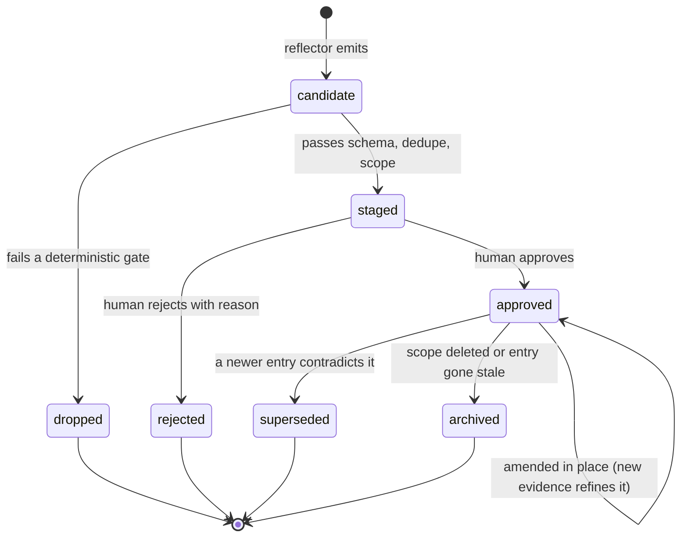

# Cairn store specification

This document specifies the `.cairn/` store format: the directory layout, the
entry lifecycle, the quality bar an entry must clear, and the frontmatter
fields an entry file carries. It is the contract a second implementation
reads to produce a store any Cairn-aware harness can consume, unmodified.

The normative schemas are `cairn/schema/entry.schema.json` and
`cairn/schema/trace.schema.json` — both JSON Schema 2020-12, both *generated*
from the Pydantic models in `cairn/core/models.py` (run
`scripts/generate_schemas.py` after changing a model; `tests/test_models.py`
fails in CI if the two fall out of sync). This document explains what those
schemas mean; they remain the machine-checkable source of truth for shape.

`spec_version` (currently `0.1.0`) versions this document and the schemas
together. A change to the entry schema's required fields, enum values, or
lifecycle semantics bumps `spec_version` and gets a migration note here.

---

## Table of contents

- [The `.cairn/` directory layout](#the-cairn-directory-layout)
- [Entry lifecycle](#entry-lifecycle)
- [Entry quality criteria](#entry-quality-criteria)
- [Frontmatter field reference](#frontmatter-field-reference)

---

## The `.cairn/` directory layout

```text
.cairn/
├── VERSION                  # spec version, e.g. "0.1.0"
├── config.toml              # provider, budgets, scopes, redaction rules
├── CONTEXT.md               # generated: the injectable context block
├── entries/                 # trusted, human-approved knowledge
│   ├── strategy/
│   ├── gotcha/
│   └── fact/
├── staging/                 # candidates awaiting review (flat: staging/*.md)
├── rejected/                # tombstones: id + reason, prevents re-proposal
├── queue/                   # pending capture jobs        (gitignored)
├── traces/                  # normalized session traces   (gitignored, TTL)
└── schema/
    ├── entry.schema.json
    └── trace.schema.json
```

| Path | Committed? | Contents |
|---|---|---|
| `VERSION` | yes | The `spec_version` this store was written against. |
| `config.toml` | yes | Provider, redaction, injection-budget, and review settings. |
| `CONTEXT.md` | yes | The rendered, token-budgeted context block built from `entries/`. Regenerated by the injector; not hand-edited. |
| `entries/<type>/` | yes | One Markdown file per approved entry, partitioned by `type`. |
| `staging/` | yes | Candidate entries awaiting a human decision, stored flat as `staging/*.md` (not partitioned by type). Same file shape as `entries/<type>/`, with `status: staged`. |
| `rejected/` | yes | Tombstones: `rejected/<id>.json`, holding only `id`, `title`, and `reason` — not a full `Entry`. Suppresses re-proposal of the same candidate. |
| `queue/` | **no** | Pending capture jobs — one small JSON record per session, written by the capture hook and drained by the reflect worker. Ephemeral by design. |
| `traces/` | **no** | Normalized `SessionTrace` documents, TTL'd. The store keeps only a hash of the source excerpt for provenance, not the excerpt itself. |
| `schema/` | yes | The JSON Schemas this spec normatively refers to. |

The split is deliberate: everything a reviewer needs to audit the store's
*knowledge* is committed and diffable; everything that is raw session
exhaust (`queue/`, `traces/`) is local and disposable.

---

## Entry lifecycle

An entry's persisted `status` field takes one of five values:
`staged`, `approved`, `rejected`, `superseded`, `archived`. Two additional
states exist only *before* an entry is ever written to disk — `candidate`
(what the reflector emits, in memory) and `dropped` (a candidate that failed
a deterministic gate and was discarded without being staged) — so they never
appear as a `status` value. Likewise, "amended" is a transition, not a
resting state: applying a delta update to an approved entry updates its
`updated` timestamp and body in place and leaves `status: approved`.



| Transition | Trigger | Effect |
|---|---|---|
| `candidate` → `dropped` | Fails schema validation, is a duplicate of an approved entry with nothing new to add, or matches a `rejected/` tombstone. | Never written to `staging/`. |
| `candidate` → `staged` | Passes schema, near-duplicate, contradiction, and scope gates. | Written to `staging/`, `status: staged`. |
| `staged` → `approved` | Human runs `cairn review` and approves (optionally editing the body). | Moved to `entries/<type>/`; `review.approved_by` / `review.approved_at` set. |
| `staged` → `rejected` | Human rejects with a reason. | Written to `rejected/<id>.json` as a tombstone (`id`, `title`, `reason` only). Not re-proposed. |
| `approved` → `approved` (amended) | A later session's reflector surfaces refining evidence for the same fact. | Body and `evidence` updated in place; `updated` bumped. `status` unchanged. |
| `approved` → `superseded` | A later entry contradicts this one. | This entry's `status` becomes `superseded`; the new entry's `supersedes` lists this entry's `id`. Both are shown to the reviewer. |
| `approved` → `archived` | `cairn prune` finds the entry's `scope` no longer matches any path, or it is unused past the stale-days threshold. | `status` becomes `archived`; excluded from injection. |

`rejected/` and `archived`/`superseded` entries are never deleted outright —
keeping the tombstone is what stops the same low-value candidate from being
re-proposed every session, which is the difference between a review gate and
a review treadmill.

The tombstone does not currently carry a content hash, so suppression is
keyed on `id` alone; the reflect e2e tests surfaced that this cannot catch a
re-proposed candidate that gets a new generated id for the same underlying
content. A planned addition — a content hash such as `excerpt_sha256` on the
tombstone — is needed before staging-level duplicate suppression can be
built on top of it. That work belongs to the Curator, not to this document.

---

## Entry quality criteria

These are the acceptance bar the reflector's candidates are held to, and the
grading rubric for `cairn eval`. An entry must be:

| Criterion | Test |
|---|---|
| **Actionable** | A reader can do something differently because of it. |
| **Project-specific** | It would not be true of a random repository in the same language. |
| **Stable** | It will still be true next month, not a fact about one branch. |
| **Evidence-backed** | It points at a real artifact — file, error, commit — not a vibe. |
| **Atomic** | One claim per entry. Compound entries cannot be superseded cleanly. |
| **Non-redundant** | It is not already stated by an approved entry or by `AGENTS.md`. |
| **Future-useful** | A different agent, on a different day, would benefit from reading it. |

Anything that fails one of these is a candidate for `rejected/`, and the
failed criterion is the rejection reason recorded in the tombstone.

---

## Frontmatter field reference

An entry file is Markdown with YAML frontmatter; the frontmatter is what
`cairn/schema/entry.schema.json` validates (the Markdown body — the prose
under `## What happens` / `## What to do` / etc. — is free text and out of
schema scope). Field types below mirror `cairn.core.models.Entry` exactly.

| Field | Type | Required | Notes |
|---|---|---|---|
| `id` | string | yes | Stable identifier, e.g. `gotcha-7b21c4`. |
| `type` | enum: `strategy` \| `gotcha` \| `fact` | yes | Determines which `entries/<type>/` subdirectory the file lives in. |
| `title` | string | yes | One-line summary shown in `cairn review` and `cairn stats`. |
| `status` | enum: `staged` \| `approved` \| `rejected` \| `superseded` \| `archived` | yes | See [Entry lifecycle](#entry-lifecycle). |
| `spec_version` | string | yes | The store spec version this entry was written against. |
| `scope` | array of glob strings | no (default `[]`) | Paths this entry is relevant to, e.g. `["tests/**", "alembic/**"]`. Used to filter injection by `cairn context --scope`. |
| `tags` | array of strings | no (default `[]`) | Free-form labels, e.g. `[testing, database, ci]`. |
| `confidence` | enum: `low` \| `medium` \| `high` | yes | The reflector's or reviewer's confidence in the claim. |
| `evidence` | object | yes | See below. |
| `evidence.harness` | string | yes | e.g. `claude-code`, `codex`, or `manual`. |
| `evidence.session_id` | string or null | no | Absent for hand-written entries. |
| `evidence.captured_at` | datetime | yes | When the source session or manual entry was captured. |
| `evidence.artifacts` | array of strings | no (default `[]`) | Files the entry is grounded in. |
| `evidence.commit` | string or null | no | Commit SHA the session touched, if any. |
| `evidence.excerpt_sha256` | string or null | no | Hash of the transcript excerpt the entry was derived from; the excerpt itself is never stored. |
| `created` | datetime | yes | When the entry file was first written. |
| `updated` | datetime | yes | Bumped on every amendment. |
| `supersedes` | array of strings | no (default `[]`) | Ids of entries this one replaces. |
| `review` | object or null | no (default `null`) | Absent until a human acts on the entry. |
| `review.approved_by` | string or null | no | Set on approval. |
| `review.approved_at` | datetime or null | no | Set on approval. |
| `usage` | object | no (default all-zero) | See below. |
| `usage.injected` | integer | no (default `0`) | Times this entry has been included in `cairn context` output. |
| `usage.marked_useful` | integer | no (default `0`) | Reserved for future feedback signals. |
| `usage.marked_stale` | integer | no (default `0`) | Reserved for future feedback signals. |

The canonical `SessionTrace` shape (`session_id`, `harness`, `started_at`,
`ended_at`, `turns`, `errors`, `diffs`, `outcome`) is normalized-transcript
territory rather than store territory — it lives only in the gitignored
`traces/` directory — and is specified by `cairn/schema/trace.schema.json`
and `cairn.core.models.SessionTrace`, not repeated here.
